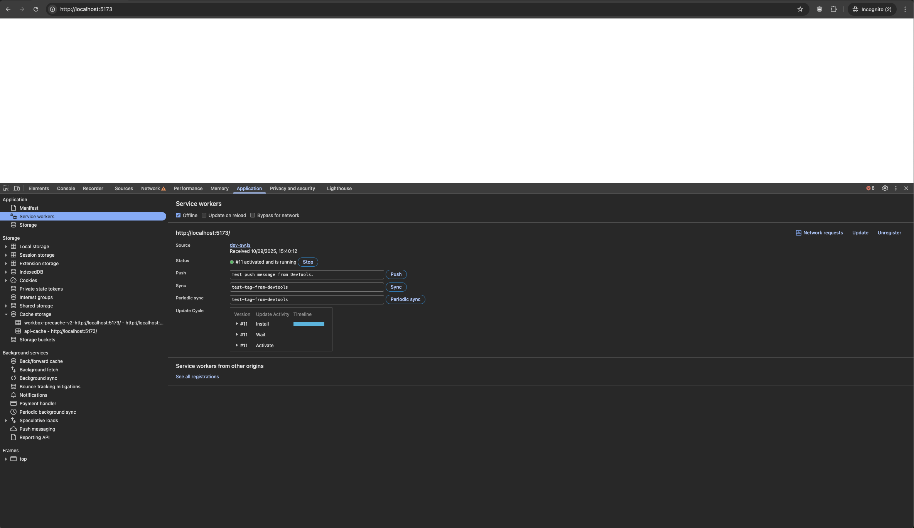

# Example Progressive Web App (Service Worker) + Vite.js / React / Workbox

<!-- TOC -->
* [Example Progressive Web App (Service Worker) + Vite.js / React / Workbox](#example-progressive-web-app-service-worker--vitejs--react--workbox)
  * [NPM Packages](#npm-packages)
  * [Running on localhost](#running-on-localhost)
  * [Noteworthy example files](#noteworthy-example-files)
  * [Useful links:](#useful-links)
  * [Useful screenshots](#useful-screenshots)
    * [Registered list](#registered-list)
    * [Cache storage](#cache-storage)
    * [Request interception cache storage hit](#request-interception-cache-storage-hit)
<!-- TOC -->

## NPM Packages

1.`vite-plugin-pwa` Zero-config PWA Framework-agnostic Plugin for Vite: https://github.com/vite-pwa/vite-plugin-pwa,
see [guide](https://vite-pwa-org.netlify.app/guide/)

* Includes `workbox`: Production-ready service worker libraries and
  tooling: https://developers.google.com/web/tools/workbox
    * `workbox-build`: https://developer.chrome.com/docs/workbox/modules/workbox-build#type-StrategyName
    * `workbox-core`: https://developer.chrome.com/docs/workbox/modules/workbox-core
    * `workbox-window`: https://developer.chrome.com/docs/workbox/modules/workbox-window

## Running on localhost

```bash
npm install
npm run build
npm run dev
```

1. Open http://localhost:5173 in your browser.
2. See dev tools Application tab > Service Workers section to inspect the service worker. Refer to **Debugging Service
   Workers** in (Useful links)[#useful-links] for more information.

## Noteworthy example files

* `vite.config.ts` Vite configuration file where the PWA plugin is configured
    * `workbox.runtimeCaching`: This is the most important part for offline web service integration. Here you define (
      multiple) rules for different types of requests
    * `urlPattern`: A string or regular expression to match the URLs of the web service you want to cache
    * `handler`: The caching strategy to use. Options are `NetworkFirst`, `CacheFirst`, `StaleWhileRevalidate`, and
      `CacheOnly`. See https://developer.chrome.com/docs/workbox/modules/workbox-strategies for more details.
    * `options`: Further customization, such as the `cacheName` and expiration settings
* `public/manifest.json` Web App Manifest file
* `src/main.tsx` Main entry point of the React application
* `src/App.tsx` Example fetching data from API https://jsonplaceholder.typicode.com/posts
* `src/PWAUpdate.tsx` React component to handle PWA updates
* `pwa-assets.config.ts` Configuration for generating PWA assets (icons, splash screens, etc.)

## [Useful links](#useful-links):

* Scaffolding Vite PWA project: https://vite-pwa-org.netlify.app/guide/#scaffolding-your-first-vite-pwa-project
* Debugging Service Workers: https://developer.chrome.com/docs/devtools/progressive-web-apps#summary
* Workbox caching strategies: https://developer.chrome.com/docs/workbox/modules/workbox-strategies#type-CacheFirst

## Useful screenshots

### Registered list

Go to dev tools > Application tab > Application > Service Workers section


### Cache storage

Go to dev tools > Application tab > Storage > Cache storage section


### Request interception cache storage hit

1. Go to dev tools > Network tab
2. Add filter `is:service-worker-intercepted`. Note `(ServiceWorker)` under Size column


